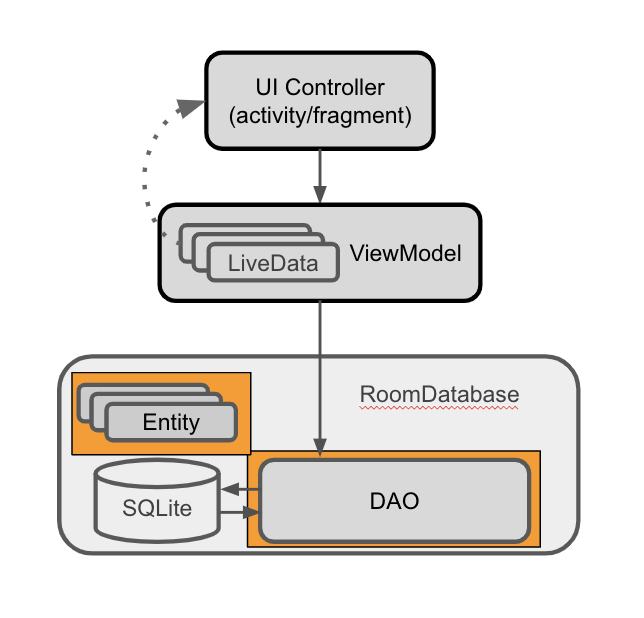
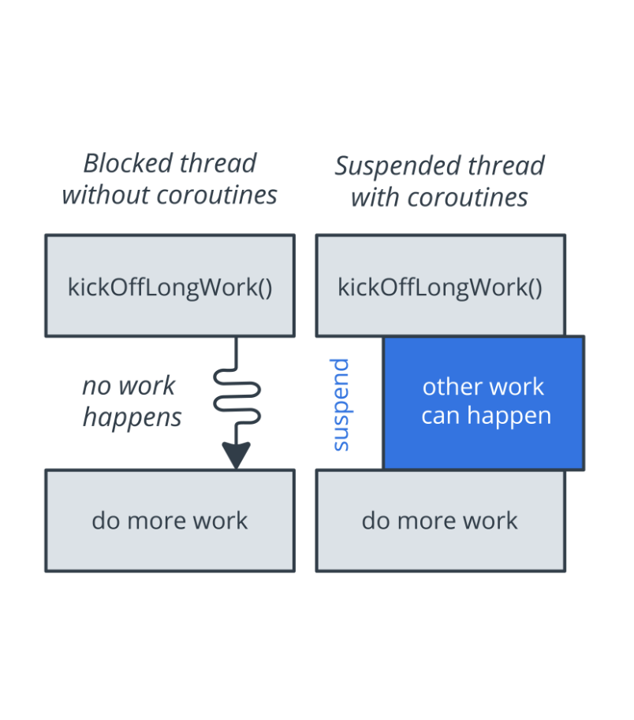

## Lesson 06: App Architecture (Persistence)

> This lesson is all about data persistence, there are many ways to storing data permanently, but with [Room](https://developer.android.com/topic/libraries/architecture/room) things have become even easier than ever before! We will be building **[Track My Sleep Quality](https://github.com/udacity/andfun-kotlin-sleep-tracker/)** app.

Most apps have data that needs to be kept, even after the user closes the app. For example, the app might store a playlist, an inventory of game items, records of expenses and income, a catalog of constellations, or sleep data over time. Commonly, you would use a database to store persistent data.Most apps have data that needs to be kept, even after the user closes the app. For example, the app might store a playlist, an inventory of game items, records of expenses and income, a catalog of constellations, or sleep data over time. Commonly, you would use a database to store persistent data.

### Tour of the App

- The app will show the UI for the `SleepTrackerFragment`, but no data, and the buttons do not respond to clicks.
- Notice the provided dependencies in **module gradle file**for all the **Android Jetpack** libraries, including **Room**, and the dependencies for coroutines.

```groovy
// Room and Lifecycle dependencies
implementation "androidx.room:room-runtime:$version_room"
kapt "androidx.room:room-compiler:$version_room"
implementation "androidx.lifecycle:lifecycle-extensions:$version_lifecycle_extensions"

// Coroutines
implementation "org.jetbrains.kotlinx:kotlinx-coroutines-core:$version_coroutine"
implementation "org.jetbrains.kotlinx:kotlinx-coroutines-android:$version_coroutine"

// Kotlin Extensions and Coroutines support for Room
implementation "androidx.room:room-ktx:$version_room"
```

- The app is structured by functionality. There is one package for all database code. In the starter app, it contains a placeholder file for defining sleep data.
- The `sleepquality` and `sleeptracker` packages contain the provided fragments, and you will add most of your code in those two packages.
- The `Util.kt` file contains functions to help display sleep quality data. Some code is commented out because it references a `ViewModel`, which you will create later.
- **androidTest folder/SleepDatabaseTest.kt** will be used to verify that the database is working as intended.

### SQL
This course assumes that you are familiar with databases in general, SQL databases in particular, and the SQL language used to interact with them.
This [page](https://developer.android.com/courses/extras/sql-primer) is a refresher and quick reference about SQLite.

### Designing Entities

In Android, data is represented in data classes, and the data is accessed and modified using function calls. However, in the database world, you need _entities_ and _queries_.

**Entity**:
* An _entity_ represents an object or concept, and its properties, to store in the database. An entity class defines a table, and each instance of that class represents a row in the table.
* Each property defines a column. In your app, the entity is going to hold information about a night of sleep.

**Query**:
* A _query_ is a request for data or information from a database table or combination of tables, or a request to perform an action on the data.
* Common queries are for getting, inserting, and updating entities. For example, you could query for all the sleep nights on record, sorted by start time.

`Room` does all the hard work for you to get from Kotlin data classes to entities that can be stored in SQLite tables, and from function declarations to SQL queries.

You must define each **[entity](https://developer.android.com/training/data-storage/room/defining-data.html) as an annotated data class,** and the **interactions as an annotated interface,** a _data access object (DAO)_. `Room` uses these [annotated](https://developer.android.com/reference/android/arch/persistence/room/package-summary#annotations) classes to create tables in the database, and queries that act on the database.



1. In the `database` package, find and open the `SleepNight.kt` file.
2. Create the `SleepNight` data class with parameters for an ID, start time and end time in milliseconds, and a numerical sleep quality rating:

```kotlin
data class SleepNight  (
    var nightId: Long = 0L,
    val startTimeMilli: Long =  System.currentTimeMillis(),
    var endTimeMilli: Long = startTimeMilli,
    var sleepQuality: Int = -1
)
```

3. Annotate the data class with `@Entity`, and name the table `daily_sleep_quality_table`. (Remember to perform the necessary imports for this and all the following annotations.)

```kotlin
@Entity(tableName = "daily_sleep_quality_table")
```

4. Identify the `nightId` as the [primary key](https://developer.android.com/reference/android/arch/persistence/room/PrimaryKey.html) by annotating it with `@PrimaryKey`, and set the `autoGenerate` parameter to `true`:

```kotlin
@PrimaryKey(autoGenerate = true)
```

5. Annotate the remaining properties with [ColumnInfo](https://developer.android.com/reference/android/arch/persistence/room/ColumnInfo) `@ColumnInfo` and customize their names as shown below.

```kotlin
import androidx.room.ColumnInfo
import androidx.room.Entity
import androidx.room.PrimaryKey

@Entity(tableName = "daily_sleep_quality_table")
data class SleepNight(
    @PrimaryKey(autoGenerate = true)
    var nightId: Long = 0L,

    @ColumnInfo(name = "start_time_milli")
    val startTimeMilli: Long = System.currentTimeMillis(),

    @ColumnInfo(name = "end_time_milli")
    var endTimeMilli: Long = startTimeMilli,

    @ColumnInfo(name = "quality_rating")
    var sleepQuality: Int = -1
)
```

### Data Access Object (DAO)
- When you use a `Room` database, you query the database by defining and calling Kotlin functions in your code. These Kotlin functions map to SQL queries. You define those mappings in a DAO using annotations, and `Room` creates the necessary code.
- Think of a DAO as defining a custom interface for accessing your database.
- For common database operations, the `Room` library provides convenience annotations, such as `@Insert`, `@Delete`, and `@Update`. For everything else, there is the `@Query` annotation. You can write any query that's supported by SQLite.
- As an added bonus, as you create your queries in Android Studio, the compiler checks your SQL queries for syntax errors.

For the sleep-tracker database of sleep nights, you need to be able to do the following:
* **Insert** new nights.
* **Update** an existing night to update an end time and a quality rating.
* **Get** a specific night based on its key.
* **Get all nights**, so you can display them.
* **Get the most recent night.** when we don't have a key that matches.
* **Delete** all entries in the database.

### Creating the SleepDatabase DAO
1. In the `database` package, open `SleepDatabaseDao.kt`. Create an interface `SleepDatabaseDao` and annotate it with `@Dao`.

```kotlin
@Dao
interface SleepDatabaseDao {}
```

2. Inside the body of the interface, add an `@Insert` annotation. Below the `@Insert`, add an `insert()` function that takes an instance of the `Entity` class `SleepNight`  as its argument. `Room` will generate all the necessary code to insert the passed-in `SleepNight` into the database. **Note** that you can call the function anything you want.

```kotlin
@Insert
fun insert(night: SleepNight)
```

3. Add an `@Update` annotation with an `update()` function for one `SleepNight`. The entity that's updated is the entity that has the same key as the one that's passed in. You can update some or all of the entity's other properties.

```kotlin
@Update
fun update(night: SleepNight)
```

4. Add a `@Query` annotation with a `get()` function that takes a `Long` `key`  argument and returns a nullable `SleepNight`. Add a parameter to `@Query`. Make it a `String` that is a SQLite query that selects all columns from the `daily_sleep_quality_table WHERE` the `nightId` matches the `:key` argument.

```kotlin
@Query("SELECT * from daily_sleep_quality_table WHERE nightId = :key")
fun get(key: Long): SleepNight?
```

5. Add another `@Query` with a `clear()` function and a SQLite query to `DELETE` everything from the `daily_sleep_quality_table`. This query does not delete the table itself.

```kotlin
@Query("DELETE FROM daily_sleep_quality_table")
fun clear()
```

*Note*: The `@Delete` annotation deletes one item, and you could use `@Delete` and supply a list of nights to delete. The drawback is that you need to fetch or know what's in the table. The `@Delete` annotation is great for deleting specific entries, but not efficient for clearing all entries from a table.

6. Add a `@Query` with a `getTonight()` function. Make the `SleepNight` returned by `getTonight()` nullable, so that the function can handle the case where the table is empty. (The table is empty at the beginning, and after the data is cleared.)
    * You get tonight by writing a SQLite query that returns the first element of a list of results ordered by nightId in descending order. Use `LIMIT 1` to return only one element.

```kotlin
@Query("SELECT * FROM daily_sleep_quality_table ORDER BY nightId DESC LIMIT 1")
fun getTonight(): SleepNight?
```

7. Add a `@Query` with a `getAllNights()` function:
    * The SQLite query should return all columns from the `daily_sleep_quality_table`, ordered in descending order. Let `getAllNights()` return a list of `SleepNight` as `LiveData`. `Room` keeps this `LiveData` updated for us, and we don't have to specify an observer for it.
    * You may need to import `LiveData` from `androidx.lifecycle.LiveData`.

```kotlin
@Query("SELECT * FROM daily_sleep_quality_table ORDER BY nightId DESC")
fun getAllNights(): LiveData<List<SleepNight>>
```

### Creating a [Room](https://developer.android.com/reference/android/arch/persistence/room/RoomDatabase) [Database](https://developer.android.com/reference/android/arch/persistence/room/Database)
You need to create an abstract database holder class, annotated with `@Database`. This class has one method that either creates an instance of the database if the database doesn't exist, or returns a reference to an existing database.

Getting a `Room` database is a bit involved, so here's the general process before you start with the code:

* Create a `public abstract` class that `extends RoomDatabase`. This class is to act as a database holder. The class is abstract, because `Room` creates the implementation for you.
* Annotate the class with `@Database`. In the arguments, declare the entities for the database and set the version number.
* Inside a [companion object](https://kotlinlang.org/docs/reference/object-declarations.html#Companion-Objects), define an abstract method or property that returns a `SleepDatabaseDao`. `Room` will generate the body for you.
* You only need one instance of the `Room` database for the whole app, so make the `RoomDatabase` a [singleton](https://en.wikipedia.org/wiki/Singleton_pattern).
* Use `Room`'s database [builder](https://developer.android.com/reference/android/arch/persistence/room/RoomDatabase.Builder) to create the database only if the database doesn't exist. Otherwise, return the existing database.

**Tip:** The code will be much the same for any `Room` database, so you can use this code as a template.

1. In the `database` package, open `SleepDatabase.kt` and create an `abstract` class called `SleepDatabase` that extends `RoomDatabase`.Annotate the class with `@Database` and supply the `SleepNight` as the only item with the list of `entities`, set the `version` as `1`, and set `exportSchema` to `false`, so as not to keep schema version history backups.
**Note**: Whenever you change the schema, you'll have to increase the version number.

```kotlin
@Database(entities = [SleepNight::class], version = 1, exportSchema = false)
abstract class SleepDatabase : RoomDatabase() {
}
```

2. The database needs to know about the DAO. Inside the body of the class, declare an abstract value that returns the `SleepDatabaseDao`. You can have multiple DAOs.

```kotlin
abstract val sleepDatabaseDao: SleepDatabaseDao
```

3. Below that, define a `companion` object. The [companion object](https://kotlinlang.org/docs/reference/object-declarations.html#Companion-Objects) allows clients to access the methods for creating or getting the database without instantiating the class. Since the only purpose of this class is to provide a database, there is no reason to ever instantiate it.

```kotlin
companion object {}
```

4. Inside the `companion` object, declare a private nullable variable `INSTANCE` for the database and initialize it to `null`. The `INSTANCE` variable will keep a reference to the database, once one has been created. This helps you avoid repeatedly opening connections to the database, which is expensive.
* Annotate `INSTANCE` with `@Volatile`. The value of a [volatile](https://developer.android.com/jetpack/docs/guide#separation-of-concerns) variable _will never be cached_, and all writes and reads will be done to and from the main memory. This helps make sure the value of `INSTANCE` is always up-to-date and the same to all execution threads. It means that changes made by one thread to `INSTANCE` are visible to all other threads immediately, and you don't get a situation where, say, two threads each update the same entity in a cache, which would create a problem.

```kotlin
@Volatile
private var INSTANCE: SleepDatabase? = null
```

5. Below `INSTANCE`, still inside the `companion` object, define a `getInstance()`method with a `Context` parameter that the database builder will need. Return a type `SleepDatabase`. You'll see an error because `getInstance()` isn't returning anything yet.

```kotlin
fun getInstance(context: Context): SleepDatabase {}
```

6. Inside `getInstance()`, add a `synchronized{}` block. Pass in `this` so that you can access the context.  

**Note:** Multiple threads can potentially ask for a database instance at the same time, resulting in two databases instead of one. This problem is not likely to happen in this sample app, but it's possible for a more complex app. Wrapping the code to get the database into `synchronized` means that only one thread of execution at a time can enter this block of code, which makes sure the database only gets initialized once.

```kotlin
synchronized(this) {}
```

7. Inside the synchronized block, copy the current value of `INSTANCE` to a local variable `instance`. This is to take advantage of [smart cast](https://kotlinlang.org/docs/reference/typecasts.html), which is only available to local variables.

```kotlin
var instance = INSTANCE
```

8. Inside the `synchronized` block, `return instance` at the end of the `synchronized` block. Ignore the return type mismatch error; you won't ever return null once you are done.

```kotlin
return instance
```

9. Above the `return` statement, add an `if` statement to check whether `instance` is null, that is, there is no database yet. If `instance` is `null`, use the database [builder](https://developer.android.com/reference/android/arch/persistence/room/RoomDatabase.Builder) to get a database. In the body of the `if` statement, invoke `Room.databaseBuilder` and supply the context that you passed in, the database class, and a name for the database, `sleep_history_database`. To remove the error, you'll have to add a migration strategy and `build()` in the following steps.

```kotlin
instance = Room.databaseBuilder(
        context.applicationContext,
        SleepDatabase::class.java,
        "sleep_history_database"
)
```

10. Add the required migration strategy to the [builder](https://developer.android.com/reference/android/arch/persistence/room/RoomDatabase.Builder). Use `.fallbackToDestructiveMigration()`.  Normally, you would have to provide a [migration](https://medium.com/androiddevelopers/understanding-migrations-with-room-f01e04b07929) object with a migration strategy for when the schema changes. A _migration object_ is an object that defines how you take all rows with the old schema and convert them to rows in the new schema, so that no data is lost. [Migration](https://medium.com/androiddevelopers/understanding-migrations-with-room-f01e04b07929) is beyond the scope of this course. A simple solution is to destroy and rebuild the database, which means that the data is lost.

```kotlin
.fallbackToDestructiveMigration()
```

11. Finally, call `.build()`.

```kotlin
.build()
```

12. Assign `INSTANCE = instance` as the final step inside the `if` statement.

```kotlin
INSTANCE = instance
```

Your final code should look like this:
```kotlin
import android.content.Context
import androidx.room.Database
import androidx.room.Room
import androidx.room.RoomDatabase

/**
 * A database that stores SleepNight information.
 * And a global method to get access to the database.
 *
 * This pattern is pretty much the same for any database,
 * so you can reuse it.
 */
@Database(entities = [SleepNight::class], version = 1, exportSchema = false)
abstract class SleepDatabase : RoomDatabase() {

    /**
     * Connects the database to the DAO.
     */
    abstract val sleepDatabaseDao: SleepDatabaseDao

    /**
     * Define a companion object, this allows us to add functions on the SleepDatabase class.
     *
     * For example, clients can call `SleepDatabase.getInstance(context)` to instantiate
     * a new SleepDatabase.
     */
    companion object {
        /**
         * INSTANCE will keep a reference to any database returned via getInstance.
         *
         * This will help us avoid repeatedly initializing the database, which is expensive.
         *
         *  The value of a volatile variable will never be cached, and all writes and
         *  reads will be done to and from the main memory. It means that changes made by one
         *  thread to shared data are visible to other threads.
         */
        @Volatile
        private var INSTANCE: SleepDatabase? = null

        /**
         * Helper function to get the database.
         *
         * If a database has already been retrieved, the previous database will be returned.
         * Otherwise, create a new database.
         *
         * This function is threadsafe, and callers should cache the result for multiple database
         * calls to avoid overhead.
         *
         * This is an example of a simple Singleton pattern that takes another Singleton as an
         * argument in Kotlin.
         *
         * To learn more about Singleton read the wikipedia article:
         * https://en.wikipedia.org/wiki/Singleton_pattern
         *
         * @param context The application context Singleton, used to get access to the filesystem.
         */
        fun getInstance(context: Context): SleepDatabase {
            // Multiple threads can ask for the database at the same time, ensure we only initialize
            // it once by using synchronized. Only one thread may enter a synchronized block at a
            // time.
            synchronized(this) {
                // Copy the current value of INSTANCE to a local variable so Kotlin can smart cast.
                // Smart cast is only available to local variables.
                var instance = INSTANCE
                // If instance is `null` make a new database instance.
                if (instance == null) {
                    instance = Room.databaseBuilder(
                            context.applicationContext,
                            SleepDatabase::class.java,
                            "sleep_history_database"
                    )
                            // Wipes and rebuilds instead of migrating if no Migration object.
                            // Migration is not part of this lesson. You can learn more about
                            // migration with Room in this blog post:
                            // https://medium.com/androiddevelopers/understanding-migrations-with-room-f01e04b07929
                            .fallbackToDestructiveMigration()
                            .build()
                    // Assign INSTANCE to the newly created database.
                    INSTANCE = instance
                }
                // Return instance; smart cast to be non-null.
                return instance
            }
        }
    }
}
```
You now have all the building blocks for working with your `Room` database. This code compiles and runs, but you have no way of telling if it actually works. So, this is a good time to add some basic tests.

### [Testing](https://developer.android.com/training/testing) the Room Database
In this step, you run provided tests to verify that your database works. This helps ensure that the database works before you build onto it. The provided tests are basic. For a production app, you would exercise all of the functions and queries in all the DAOs.

The starter app contains an **androidTest** folder. This **androidTest** folder contains unit tests that involve Android instrumentation, which is a fancy way of saying that the tests need the Android framework, so you need to run the tests on a physical or virtual device. Of course, you can also create and run pure unit tests that do not involve the Android framework.

In the `androidTest` folder, open the `SleepDatabaseTest` file. Uncomment the code. Right-click on the test file in the Project view and choose Run. After the app builds and runs, verify in the `SleepDatabaseTest` pane that all the tests have passed.

Here's a quick run-through of the testing code, because it's another piece of code that you can reuse:

* `SleepDabaseTest` is a test class.
* The `@RunWith` annotation identifies the test runner, which is the program that sets up and executes the tests.
* During setup, the function annotated with `@Before` is executed, and it creates an in-memory `SleepDatabase` with the `SleepDatabaseDao`. "In-memory" means that this database is not saved on the file system and will be deleted after the tests run.
* Also when building the in-memory database, the code calls another test-specific method, `allowMainThreadQueries`. By default, you get an error if you try to run queries on the main thread. This method allows you to run tests on the main thread, which you should only do during testing.
* In a test method annotated with `@Test`, you create, insert, and retrieve a `SleepNight`, and assert that they are the same. If anything goes wrong, throw an exception. In a real test, you would have multiple `@Test`  methods.
* When testing is done, the function annotated with `@After` executes to close the database.

### Displaying Sleep Data
Open `activity_main.xml`. This layout contains the `nav_host_fragment`.
Also, notice the `merge` tag. The merge tag can be used to eliminate redundant layouts when including layouts, and it's a good idea to use it. You can find more information about it [here](https://developer.android.com/training/improving-layouts/reusing-layouts).

```xml
<merge xmlns:android="http://schemas.android.com/apk/res/android"
    xmlns:app="http://schemas.android.com/apk/res-auto">

    <fragment
        android:id="@+id/nav_host_fragment"
        android:name="androidx.navigation.fragment.NavHostFragment"
        android:layout_width="match_parent"
        android:layout_height="match_parent"
        app:defaultNavHost="true"
        app:navGraph="@navigation/navigation" />

</merge>
```

### Adding A ViewModel
Now that you have a database and a UI, you need to collect data, add the data to the database, and display the data. All this work is done in the view model. Your sleep-tracker view model will handle button clicks, interact with the database via the `DAO`, and provide data to the UI via `LiveData`. All database operations will have to be run away from the main UI thread, and you'll do that using `coroutines`.

1. In the **sleeptracker** package, open **SleepTrackerViewModel.kt**. Inspect the provided `SleepTrackerViewModel` class definition that extends `AndroidViewModel()`. This class is the same as `ViewModel`, but it takes the application context as a parameter and makes it available as a property. You are going to need this later on to access resources. The `ViewModel` needs access to the data in the database, so pass in an instance of the `SleepDatabaseDao`. And then pass this up to the super class as well.

```kotlin
class SleepTrackerViewModel(
       val database: SleepDatabaseDao,
       application: Application) : AndroidViewModel(application) {
}
```

2. In the **sleeptracker** package, open **SleepTrackerViewModelFactory.kt.
* The provided `SleepTrackerViewModelFactory` takes the same argument as the `ViewModel` and extends `ViewModelProvider.Factory`.
* Inside the factory, the code overrides `create()`, which takes any class type as an argument and returns a `ViewModel`.
* In the body of `create()`, the code checks that there is a `SleepTrackerViewModel` class available, and if there is, returns an instance of it. Otherwise, the code throws an exception.

**Tip:** This is mostly boilerplate code, so you can reuse the code for future view-model factories.

```kotlin
class SleepTrackerViewModelFactory(
       private val dataSource: SleepDatabaseDao,
       private val application: Application) : ViewModelProvider.Factory {
   @Suppress("unchecked_cast")
   override fun <T : ViewModel?> create(modelClass: Class<T>): T {
       if (modelClass.isAssignableFrom(SleepTrackerViewModel::class.java)) {
           return SleepTrackerViewModel(dataSource, application) as T
       }
       throw IllegalArgumentException("Unknown ViewModel class")
   }
}
```

3. In the `SleepTrackerFragment`, get a reference to the application context. Put the reference in `onCreateView()`, below `binding`. You need a reference to the app that this fragment is attached to, to pass into the view-model factory provider.

```kotlin
val application = requireNotNull(this.activity).application
```

**Note:** The `requireNotNull` Kotlin function throws an [`IllegalArgumentException`](https://kotlinlang.org/api/latest/jvm/stdlib/kotlin/-illegal-argument-exception/index.html#kotlin.IllegalArgumentException) if the [value](https://kotlinlang.org/api/latest/jvm/stdlib/kotlin/require-not-null.html#kotlin%24requireNotNull%28kotlin.requireNotNull.T%29%2Fvalue) is `null`.

4. You need a reference to your data source via a reference to the DAO. In `onCreateView()`, before the `return`, define a `dataSource`. To get a reference to the DAO of the database, use `SleepDatabase.getInstance(application).sleepDatabaseDao`.

```kotlin
val dataSource = SleepDatabase.getInstance(application).sleepDatabaseDao
```

5. In `onCreateView()`, before the `return`, create an instance of the `viewModelFactory`. You need to pass it `dataSource` and the `application`. Now that you have a [factory](https://developer.android.com/reference/android/arch/lifecycle/ViewModelProvider.Factory), get a reference to the `SleepTrackerViewModel`. The `SleepTrackerViewModel::class.java` parameter refers to the runtime Java class of this object.

```kotlin
val viewModelFactory = SleepTrackerViewModelFactory(dataSource, application)
val sleepTrackerViewModel = ViewModelProvider(this, viewModelFactory).get(SleepTrackerViewModel::class.java)
```

Your finished code should look like this:

```kotlin
// Create an instance of the ViewModel Factory.
val dataSource = SleepDatabase.getInstance(application).sleepDatabaseDao
val viewModelFactory = SleepTrackerViewModelFactory(dataSource, application)

// Get a reference to the ViewModel associated with this fragment.
val sleepTrackerViewModel =
       ViewModelProvider(
               this, viewModelFactory).get(SleepTrackerViewModel::class.java)
```

And the `onCreateView()` method so far should look like:

```kotlin
/**
    * Called when the Fragment is ready to display content to the screen.
    *
    * This function uses DataBindingUtil to inflate R.layout.fragment_sleep_quality.
    */
override fun onCreateView(inflater: LayoutInflater, container: ViewGroup?,
                            savedInstanceState: Bundle?): View {

    // Get a reference to the binding object and inflate the fragment views.
    val binding: FragmentSleepTrackerBinding = DataBindingUtil.inflate(
            inflater, R.layout.fragment_sleep_tracker, container, false)

    val application = requireNotNull(this.activity).application

    val dataSource = SleepDatabase.getInstance(application).sleepDatabaseDao

    val viewModelFactory = SleepTrackerViewModelFactory(dataSource, application)

    val sleepTrackerViewModel =
            ViewModelProvider(
                    this, viewModelFactory).get(SleepTrackerViewModel::class.java)

    return binding.root
}
```

**Data Binding for ViewModel**
With the basic `ViewModel` in place, you need to finish setting up data binding in the `SleepTrackerFragment` to connect the `ViewModel` with the UI.

1. In `fragment_sleep_tracker.xml`: Inside the `<data>` block, create a `<variable>` that references the `SleepTrackerViewModel` class.

```xml
<data>
   <variable
       name="sleepTrackerViewModel"
       type="com.example.android.trackmysleepquality.sleeptracker.SleepTrackerViewModel" />
</data>
```

2. In `SleepTrackerFragment`:
* Set the current activity as the lifecycle owner of the binding. Add this code inside the `onCreateView()` method, before the `return` statement.
* Assign the `sleepTrackerViewModel` binding variable to the `sleepTrackerViewModel`. Put this code inside `onCreateView()`, below the code that creates the `SleepTrackerViewModel`

```kotlin
binding.sleepTrackerViewModel = sleepTrackerViewModel
binding.lifecycleOwner = this
```

### Multithreading and Coroutines
To use processors more efficiently, the operating system can enable an application to create more than one thread of execution within a process.

There is a lot of infrastructure to manage all those threads needing to run, sometimes in a given order and finished to:
* **Scheduler**: which takes into account things such as priorities and makes sure all the threads get to run and finish.
* **Dispatcher**: which sets up threads, and specifies a context for that to happen in.
* **Context**: You can think of the context as a separate specialized reading room. Some contexts are best for user interface stuff, and some are specialized to deal with input, output operations.

A user-facing application usually has a main thread that runs in a foreground and can dispatch other threads that may run into background.
* On Android, the main thread is a single thread that handles all updates to the UI. The main thread is also the thread that calls all click handlers and other UI and life cycle callbacks.
* The UI thread is the default thread, meaning unless you explicitly switched threads or use a class that runs on a different thread, everything you do is on the main thread.

It's essential to avoid blocking the UI thread. Blocking in this context means the UI thread is waiting,
not doing anything at all for an action to be done. For example, something like a database to be done updating. Many common tasks take longer than 16 milliseconds, such as fetching data from the internet,
reading a large file, or writing data to a database. Therefore, calling code like this from the main thread can cause the app to pause, stutter or even freeze.

### [Coroutines](https://kotlinlang.org/docs/reference/coroutines-overview.html)
#### Callbacks
* One pattern for performing long-running tasks without blocking the main thread is to use [callbacks](https://en.wikipedia.org/wiki/Callback_%28computer_programming%29). See the [Multi-threading & callbacks primer](https://developer.android.com/courses/extras/multithreading) for an introduction to multi-threading and callbacks.
* By using callbacks, you can start long-running tasks on a background thread.
* When a task completes, the callback supplied as an argument is called to inform you of the result on the main thread.

Callbacks have a few drawbacks:
* Codes that heavily uses callbacks can become hard to read and harder to reason about.
* Because while the code looks sequential, the callback code will run at some asynchronous time in the future.
* In addition, callbacks don't allow the use of some language features, such as exceptions.

#### Coroutines
In Kotlin, coroutines are the way to handle long-running tasks elegantly and efficiently. Kotlin coroutines let you convert callback-based code to sequential code. Code written sequentially is typically easier to read and can even use language features such as exceptions. In the end, coroutines and callbacks do the same thing: they wait until a result is available from a long-running task and continue execution.

Coroutines have the following properties:

**Coroutines are asynchronous.**
* A coroutine runs independently from the main execution steps of your program.
* This could be in parallel or on a separate processor. It could also be that while the rest of the app is waiting for input, you sneak in a bit of processing.
* One of the important aspects of async is that you cannot expect that the result is available, until you explicitly wait for it.

For example, let's say you have a question that requires research, and you ask a colleague to find the answer. They go off and work on it, which is like they're doing the work "asynchronously" and "on a separate thread." You can continue to do other work that doesn't depend on the answer, until your colleague comes back and tells you what the answer is.

**Coroutines are non-blocking.**
_Non-blocking_ means that a coroutine does not block the main or UI thread. So with coroutines, users always have the smoothest possible experience, because the UI interaction always has priority.

**Coroutines use suspend functions to make asynchronous code sequential.**
The keyword `suspend` is Kotlin's way of marking a function, or function type, as being available to coroutines. When a coroutine calls a function marked with `suspend`, instead of blocking until the function returns like a normal function call, the coroutine suspends execution until the result is ready. Then the coroutine resumes where it left off, with the result.

While the coroutine is suspended and waiting for a result, it unblocks the thread that it's running on. That way, other functions or coroutines can run.

The `suspend` keyword doesn't specify the thread that the code runs on. A suspend function may run on a background thread, or on the main thread.

**Tip:** The difference between _blocking_ and _suspending_ is that if a thread is blocked, no other work happens. If the thread is suspended, other work happens until the result is available.



To use coroutines in Kotlin, you need three things:

**[Job](https://kotlin.github.io/kotlinx.coroutines/kotlinx-coroutines-core/kotlinx.coroutines/-job/)**: Basically, a job is anything that can be canceled. Every coroutine has a job, and you can use the job to cancel the coroutine. Jobs can be arranged into parent-child hierarchies. Canceling a parent job immediately cancels all the job's children, which is a lot more convenient than canceling each coroutine manually.

**[Dispatcher](https://kotlinlang.org/docs/reference/coroutines/coroutine-context-and-dispatchers.html):** The dispatcher sends off coroutines to run on various threads. For example, `Dispatchers.Main` runs tasks on the main thread, and `Dispatchers.IO` offloads blocking I/O tasks to a shared pool of threads.

**Scope:** A coroutine's _scope_ defines the context in which the coroutine runs. A scope combines information about a coroutine's job and [dispatchers](https://kotlin.github.io/kotlinx.coroutines/kotlinx-coroutines-core/kotlinx.coroutines/-dispatchers/index.html). Scopes keep track of coroutines. When you launch a coroutine, it's "in a scope," which means that you've indicated which scope will keep track of the coroutine.

#### Kotlin coroutines with Architecture components
[`CoroutineScope`](https://kotlin.github.io/kotlinx.coroutines/kotlinx-coroutines-core/kotlinx.coroutines/-coroutine-scope/): A `CoroutineScope` keeps track of all your coroutines, helps you to manage when your coroutines should run. It can also cancel all of the coroutines started in it. Each asynchronous operation or a coroutine runs within a particular scope.

[Architecture components](https://developer.android.com/topic/libraries/architecture?authuser=1) provide first-class support for coroutines for logical scopes in your app. Architecture components define the following built-in scopes that you can use in your app. The built-in coroutine scopes are in the [KTX extensions](https://developer.android.com/kotlin/ktx?authuser=1) for each corresponding Architecture component. Be sure to add the appropriate dependencies when using these scopes.

* [`ViewModelScope`](https://developer.android.com/topic/libraries/architecture/coroutines?authuser=1#viewmodelscope)
* [`LifecycleScope`](https://developer.android.com/topic/libraries/architecture/coroutines?authuser=1#lifecyclescope)
* [`liveData`](https://developer.android.com/topic/libraries/architecture/coroutines?authuser=1#livedata)

[`ViewModelScope`](https://developer.android.com/topic/libraries/architecture/coroutines?authuser=1#viewmodelscope): A `ViewModelScope` is defined for each [`ViewModel`](https://developer.android.com/topic/libraries/architecture/viewmodel?authuser=1) in your app. Any coroutine launched in this scope is automatically canceled if the `ViewModel` is cleared. In this codelab you will use `ViewModelScope` to initiate the database operations.

#### Room and Dispatcher
When using the Room library to perform a database operation, Room uses a `Dispatchers.IO` for you to perform the database operations in the background. You don't have to explicitly specify the `Dispatchers`.

### Implementing Coroutines
<details><summary>Old method</summary>
<p>

1. Open the `SleepTrackerViewModel.kt` file. Define `viewModelJob` and assign it an instance of Job.

```kotlin
private var viewModelJob = Job()
```

2. Override onCleared() and cancel all coroutines.

```kotlin
override fun onCleared() {
    super.onCleared()
    viewModelJob.cancel()
}
```

3. Define a `uiScope` for the coroutines:

```kotlin
private val uiScope = CoroutineScope(Dispatchers.Main +  viewModelJob)
```

4. continue from Step 2.3.

</p>
</details>

#### Step 1: Mark DAO functions as suspend functions
Open `database/SleepDatabaseDao.kt`, add suspend keyword to all the methods except for `getAllNights()`. The complete `SleepDatabaseDao` class will look like this.
```kotlin
@Dao
interface SleepDatabaseDao {

   @Insert
   suspend fun insert(night: SleepNight)

   @Update
   suspend fun update(night: SleepNight)

   @Query("SELECT * from daily_sleep_quality_table WHERE nightId = :key")
   suspend fun get(key: Long): SleepNight?

   @Query("DELETE FROM daily_sleep_quality_table")
   suspend fun clear()

   @Query("SELECT * FROM daily_sleep_quality_table ORDER BY nightId DESC LIMIT 1")
   suspend fun getTonight(): SleepNight?

   @Query("SELECT * FROM daily_sleep_quality_table ORDER BY nightId DESC")
   fun getAllNights(): LiveData<List<SleepNight>>
}
```
#### Step 2: Set up coroutines for database operations

When the **Start** button in the Sleep Tracker app is tapped, you want to call a function in the `SleepTrackerViewModel` to create a new instance of `SleepNight` and store the instance in the database.

Tapping any of the buttons triggers a database operation, such as creating or updating a `SleepNight`. For this reason and others, you use coroutines to implement click handlers for the app's buttons.

1. Open the app-level `build.gradle` file. Under the dependencies section, you need these dependencies, which were added for you.

```kotlin
implementation "androidx.lifecycle:lifecycle-viewmodel-ktx:2.2.0"

// Kotlin Extensions and Coroutines support for Room
implementation "androidx.room:room-ktx:$room_version"
```

2. Open the `SleepTrackerViewModel` file. Define a variable called `tonight` to hold the current night. Make the variable `MutableLiveData`, because you need to be able to observe the data and change it.

```kotlin
private var tonight = MutableLiveData<SleepNight?>()
```

3. To initialize the `tonight` variable as soon as possible, create an `init` block below the definition of `tonight` and call `initializeTonight()`. You define `initializeTonight()` in the next step.

```kotlin
init {
    initializeTonight()
}
```

4. Below the `init` block, implement `initializeTonight()`. Use the `viewModelScope.launch` to start a coroutine in the `ViewModelScope`. Inside the curly braces, get the value for `tonight` from the database by calling `getTonightFromDatabase()`, and assign the value to `tonight.value`. You define `getTonightFromDatabase()` in the next step.

```kotlin
private fun initializeTonight() {
   viewModelScope.launch {
       tonight.value = getTonightFromDatabase()
   }
}
```

5. Implement `getTonightFromDatabase()`. Define it as a `private suspend` function that returns a nullable `SleepNight`, if there is no current started `SleepNight`. This leaves you with an error, because the function has to return something.

```kotlin
private suspend fun getTonightFromDatabase(): SleepNight? { }
```

6. Inside the function body of `getTonightFromDatabase()`, get `tonight` (the newest night) from the database. If the start and end times are not the same, meaning that the night has already been completed, return `null`. Otherwise, return the night.

```kotlin
    var night = database.getTonight()
    if (night?.endTimeMilli != night?.startTimeMilli) {
        night = null
    }
    return night
```
Your completed `getTonightFromDatabase()` `suspend` function should look like this.

```kotlin
/**
*  Handling the case of the stopped app or forgotten recording,
*  the start and end times will be the same.
*
*  If the start time and end time are not the same, 
*  then we do not have an unfinished recording.
*/
private suspend fun getTonightFromDatabase(): SleepNight? {
    var night = database.getTonight()
    if (night?.endTimeMilli != night?.startTimeMilli) {
        night = null
    }
    return night
}
```

#### Step 3: Add the click handler for the Start button

Now you can implement `onStartTracking()`, the click handler for the **Start** button. You need to create a new `SleepNight`, insert it into the database, and assign it to `tonight`. The structure of `onStartTracking()` is going to look very much like `initializeTonight()`.

1. Start with the function definition for `onStartTracking()`. You can put the click handlers above `onCleared()` in the `SleepTrackerViewModel` file.

```kotlin
fun onStartTracking() {}
```

2. Inside `onStartTracking()`, launch a coroutine in the `viewModelScope`, because you need this result to continue and update the UI.

```kotlin
viewModelScope.launch {}
```

3. Inside the coroutine launch, create a new `SleepNight`, which captures the current time as the start time.

```kotlin
val newNight = SleepNight()
```

4. Still inside the coroutine launch, call `insert()` to insert `newNight` into the database. You will see an error, because you have not defined this `insert()` suspend function yet. (This is not the DAO function of the same name.)

```kotlin
insert(newNight)
```

5. Also inside the coroutine launch, update `tonight`.

```kotlin
tonight.value = getTonightFromDatabase()
```

6. Below `onStartTracking()`, define `insert()` as a `private suspend` function that takes a `SleepNight` as its argument.

```kotlin
private suspend fun insert(night: SleepNight) {}
```

7. Within the `insert()` method, use the DAO to insert night into the database. Note that a coroutine with Room uses `Dispatchers.IO`, so this will not happen on the main thread.

```kotlin
database.insert(night)
```

The full function code should be:

```kotlin
/**
* Executes when the START button is clicked.
*/
fun onStartTracking() {
    viewModelScope.launch {
        // Create a new night, which captures the current time,
        // and insert it into the database.
        val newNight = SleepNight()

        insert(newNight)

        tonight.value = getTonightFromDatabase()
    }
}
```

8. In the `fragment_sleep_tracker.xml` layout file, add the click handler for `onStartTracking()` to the `start_button` using the magic of data binding that you set up earlier. The `@{() ->` function notation creates a lambda function that takes no arguments and calls the click handler in the `sleepTrackerViewModel`.

```xml
android:onClick="@{() -> sleepTrackerViewModel.onStartTracking()}"
```

##### The pattern
Now you can see a pattern:
1. Launch a coroutine that runs on the main or UI thread, because the result affects the UI. You can access the `CoroutineScope` of a ViewModel through the `viewModelScope` property of the ViewModel, as shown in the following example:
2. Call a suspend function to do the long-running work, so that you don't block the UI thread while waiting for the result.
3. The long-running work has nothing to do with the UI. Switch to the I/O dispatcher,(if using Room, this code is generated for you) so that the work can run in a thread pool that's optimized and set aside for these kinds of operations.
4. Then call the long running function to do the work.

**The pattern is shown below.**

```kotlin
fun someWorkNeedsToBeDone {
   viewModelScope.launch {
        suspendFunction()
   }
}

suspend fun suspendFunction() {
   withContext(Dispatchers.IO) {
       longrunningWork()
   }
}

```

**Using Room**

```kotlin
// Using Room
fun someWorkNeedsToBeDone {
   viewModelScope.launch {
        suspendDAOFunction()
   }
}

suspend fun suspendDAOFunction() {
   // No need to specify the Dispatcher, Room uses Dispatchers.IO.
   longrunningDatabaseWork()
}
```

#### Step 4: Display the data

In the `SleepTrackerViewModel`, the `nights` variable references `LiveData` because `getAllNights()` in the DAO returns `LiveData`.

It is a `Room` feature that every time the data in the database changes, the `LiveData` `nights` is updated to show the latest data. You never need to explicitly set the `LiveData` or update it. `Room` updates the data to match the database.

However, if you display `nights` in a text view, it will show the object reference. To see the contents of the object, transform the data into a formatted string. Use a `Transformation` map that's executed every time `nights` receives new data from the database.

1. Open the `Util.kt` file and uncomment the code for the definition of `formatNights()`and the associated `import` statements. To uncomment code in Android Studio, select all the code marked with `//` and press `Cmd+/` or `Control+/`.
2. Notice that `formatNights()` returns a type `Spanned`, which is an HTML-formatted string.
3. Open **strings.xml**. Notice the use of [`CDATA`](https://www.w3.org/TR/REC-xml/#sec-cdata-sect) to format the string resources for displaying the sleep data.
4. Open **SleepTrackerViewModel**. In the `SleepTrackerViewModel` class, define a variable called `nights`. Get all the nights from the database and assign them to the `nights` variable.

```kotlin
// Define a variable, nights. Then getAllNights() from the database
// and assign to the nights variable.
private val nights = database.getAllNights()
```

5. Right below the definition of `nights`, add code to transform `nights` into a `nightsString`. Use the `formatNights()` function from `Util.kt`. Pass `nights` into the [`map()`](https://developer.android.com/reference/android/arch/lifecycle/Transformations#map) function from the `Transformations` class. To get access to your string resources, define the mapping function as calling `formatNights()`. Supply `nights` and a `Resources` object.

```kotlin
/**
* Converted nights to Spanned for displaying.
*/
val nightsString = Transformations.map(nights) { nights ->
   formatNights(nights, application.resources)
}
```

6. Open the `fragment_sleep_tracker.xml` layout file. In the `TextView`, in the `android:text` property, you can now replace the resource string with a reference to `nightsString`.

```xml
android:text="@{sleepTrackerViewModel.nightsString}"
```

#### Step 5: Add the click handler for the Stop button

Using the same pattern as in the previous step, implement the click handler for the **Stop** button in `SleepTrackerViewModel.`

1. Add `onStopTracking()` to the `ViewModel`. Launch a coroutine in the `viewModelScope`. If the end time hasn't been set yet, set the `endTimeMilli` to the current system time and call `update()` with the night data. In Kotlin, the `return@label` [syntax](https://kotlinlang.org/docs/reference/returns.html#return-at-labels) specifies the function from which this statement returns, among several nested functions.

```kotlin
fun onStopTracking() {
    viewModelScope.launch {
        // In Kotlin, the return@label syntax is used for specifying which function among
        // several nested ones this statement returns from.
        // In this case, we are specifying to return from launch(),
        // not the lambda.
        val oldNight = tonight.value ?: return@launch

        // Update the night in the database to add the end time.
        oldNight.endTimeMilli = System.currentTimeMillis()

        update(oldNight)
    }
}
```

2. Implement `update()` using the same pattern as you used to implement `insert()`.

```kotlin
private suspend fun update(night: SleepNight) {
    database.update(night)
}
```

3. To connect the click handler to the UI, open the `fragment_sleep_tracker.xml` layout file and add the click handler to the `stop_button`.

```xml
android:onClick="@{() -> sleepTrackerViewModel.onStopTracking()}"
```

#### Step 6: Add the click handler for the Clear button
1. Similarly, implement `onClear()` and `clear()`.

```kotlin
/**
* Executes when the CLEAR button is clicked.
*/
fun onClear() {
    viewModelScope.launch {
        // Clear the database table.
        clear()

        // And clear tonight since it's no longer in the database
        tonight.value = null
    }
}

private suspend fun clear() {
    database.clear()
}
```

2. To connect the click handler to the UI, open `fragment_sleep_tracker.xml` and add the click handler to the `clear_button`.

```xml
android:onClick="@{() -> sleepTrackerViewModel.onClear()}"
```

### Navigation and Sleep Quality
* Now to give users a way to enter the sleep quality, we are going to use a fragment with touchable icons.
* We press "START" to start the sleep night. Then when we press "STOP" and we navigate back to the sleep quality tracker fragment, where we can press a pretty smiley icon, which takes us right back and updates the sleep quality.

In more pragmatic terms, our basic workflow is the user presses, "STOP" is:
* On stop tracking we navigate to this `SleepQualityFragment`.
* We use `safeArgs` to pass the correct night's key so that we can update the correct sleep night.
* Once the user taps a quality icon, we update the current night and return to the `SleepTrackerFragment`.
* As an additional challenge, we also need to handle the back button.
* We want the navigation to happen in the fragment, but the click handler stays in the `ViewModel` processing the data.
* We do this by creating a navigation event variable in a `ViewModel`, observe the variable, when the variable changes navigate immediately, and create a navigation event variable to signify we have finished navigating.

### Recording Sleep Quality
#### Add navigation
The navigation graph already includes the paths from the `SleepTrackerFragment` to the `SleepQualityFragment` and back again. However, the click handlers that implement the navigation from one fragment to the next are not coded yet. You add that code now in the `ViewModel`.

In the click handler, you set a `LiveData` that changes when you want the app to navigate to a different destination. The fragment observes this `LiveData`. When the data changes, the fragment navigates to the destination and tells the view model that it's done, which resets the state variable.

1. Open `SleepTrackerViewModel`. You need to add navigation so that when the user taps the **Stop** button, the app navigates to the `SleepQualityFragment` to collect a quality rating.
2. In `SleepTrackerViewModel`, create a `LiveData` that changes when you want the app to navigate to the `SleepQualityFragment`. Use encapsulation to only expose a gettable version of the `LiveData` to the `ViewModel`. You can put this code anywhere at the top level of the class body.

```kotlin
/**
* Variable that tells the Fragment to navigate to a specific [SleepQualityFragment]
*
* This is private because we don't want to expose setting this value to the Fragment.
*/

private val _navigateToSleepQuality = MutableLiveData<SleepNight>()
val navigateToSleepQuality: LiveData<SleepNight>
   get() = _navigateToSleepQuality
```

3. Add a `doneNavigating()` function that resets the variable that triggers navigation.

```kotlin
/**
* Call this immediately after navigating to [SleepQualityFragment]
*
* It will clear the navigation request, so if the user rotates their phone it won't navigate
* twice.
*/
fun doneNavigating() {
    _navigateToSleepQuality.value = null
}
```

4. In the click handler for the **Stop** button, `onStopTracking()`, trigger the navigation to the `SleepQualityFragment`. Set the `navigateToSleepQuality` variable at the end of the function as the last thing inside the `launch{}` block. Note that this variable is set to the `night`. When this variable has a value, the app navigates to the `SleepQualityFragment`, passing along the night.

```kotlin
_navigateToSleepQuality.value = oldNight
```

5. The `SleepTrackerFragment` needs to observe `navigateToSleepQuality` so that the app knows when to navigate. In the `SleepTrackerFragment`, in `onCreateView()`, add an observer for `navigateToSleepQuality()`. Note that the import for this is ambiguous and you need to import `androidx.lifecycle.Observer`.
6. Inside the observer block, navigate and pass along the ID of the current night, and then call `doneNavigating()`. If your import is ambiguous, import `androidx.navigation.fragment.findNavController`.

```kotlin
// Add an Observer on the state variable for Navigating when STOP button is pressed.
sleepTrackerViewModel.navigateToSleepQuality.observe(viewLifecycleOwner, Observer { night ->
    night?.let {
        // We need to get the navController from this, because button is not ready, and it
        // just has to be a view. For some reason, this only matters if we hit stop again
        // after using the back button, not if we hit stop and choose a quality.
        // Also, in the Navigation Editor, for Quality -> Tracker, check "Inclusive" for
        // popping the stack to get the correct behavior if we press stop multiple times
        // followed by back.
        // Also: https://stackoverflow.com/questions/28929637/difference-and-uses-of-oncreate-oncreateview-and-onactivitycreated-in-fra
        this.findNavController().navigate(
                SleepTrackerFragmentDirections
                        .actionSleepTrackerFragmentToSleepQualityFragment(night.nightId))
        // Reset state to make sure we only navigate once, even if the device
        // has a configuration change.
        sleepTrackerViewModel.doneNavigating()
    }
})
```

##### [Kotlin let](https://www.journaldev.com/19467/kotlin-let-run-also-apply-with#kotlin-let)
* `let` takes the object it is invoked upon as the parameter and returns the result of the lambda expression.  
* Kotlin let is a scoping function wherein the variables declared inside the expression cannot be used outside.
* Additionally, let is useful for checking Nullable properties as shown below.

```kotlin
var name : String? = "Kotlin let null check"
name?.let { println(it) } //prints Kotlin let null check
name = null
name?.let { println(it) } //nothing happens
```

#### Record the sleep quality
**Step 1: Create a `ViewModel` and a `ViewModelFactory`**

1. In the `sleepquality` package, create or open **SleepQualityViewModel.kt.**
2. Create a `SleepQualityViewModel` class that takes a `sleepNightKey` and database as arguments. Just as you did for the `SleepTrackerViewModel`, you need to pass in the `database` from the factory. You also need to pass in the `sleepNightKey` from the navigation.

```kotlin
/**
* ViewModel for SleepQualityFragment.
*
* @param sleepNightKey The key of the current night we are working on.
*/
class SleepQualityViewModel(
    private val sleepNightKey: Long = 0L,
    val database: SleepDatabaseDao) : ViewModel() {
}
```

3. To navigate back to the `SleepTrackerFragment` using the same pattern as above, declare `_navigateToSleepTracker`. Implement `navigateToSleepTracker` and `doneNavigating()`.

```kotlin
/**
* Variable that tells the fragment whether it should navigate to [SleepTrackerFragment].
*
* This is `private` because we don't want to expose the ability to set [MutableLiveData] to
* the [Fragment]
*/
private val _navigateToSleepTracker = MutableLiveData<Boolean?>()

/**
* When true immediately navigate back to the [SleepTrackerFragment]
*/
val navigateToSleepTracker: LiveData<Boolean?>
    get() = _navigateToSleepTracker


/**
* Call this immediately after navigating to [SleepTrackerFragment]
*/
fun doneNavigating() {
    _navigateToSleepTracker.value = null
}
```

4. Create one click handler, `onSetSleepQuality()`, for all the sleep-quality images to use. Use the same coroutine pattern:
* Launch a coroutine in the _`viewModelScope`_
* Get `tonight` using the `sleepNightKey`.
* Set the sleep quality.
* Update the database.
* Trigger navigation.

Notice that the code sample below does all the work in the click handler, instead of factoring out the database operation in the different context.

```kotlin
/**
* Sets the sleep quality and updates the database.
*
* Then navigates back to the SleepTrackerFragment.
*/
fun onSetSleepQuality(quality: Int) {
    viewModelScope.launch {
            val tonight = database.get(sleepNightKey) ?: return@launch
            tonight.sleepQuality = quality
            database.update(tonight)

        // Setting this state variable to true will alert the observer and trigger navigation.
        _navigateToSleepTracker.value = true
    }
}
```

5. In the `sleepquality` package, create or open `SleepQualityViewModelFactory.kt` and add the `SleepQualityViewModelFactory` class, as shown below. This class uses a version of the same boilerplate code you've seen before. Inspect the code before you move on.

```kotlin
/**
 * This is pretty much boiler plate code for a ViewModel Factory.
 *
 * Provides the key for the night and the SleepDatabaseDao to the ViewModel.
 */
class SleepQualityViewModelFactory(
        private val sleepNightKey: Long,
        private val dataSource: SleepDatabaseDao) : ViewModelProvider.Factory {
    @Suppress("unchecked_cast")
    override fun <T : ViewModel?> create(modelClass: Class<T>): T {
        if (modelClass.isAssignableFrom(SleepQualityViewModel::class.java)) {
            return SleepQualityViewModel(sleepNightKey, dataSource) as T
        }
        throw IllegalArgumentException("Unknown ViewModel class")
    }
}
```

**Step 2: Update the `SleepQualityFragment`**

1. Open `SleepQualityFragment.kt`.
2. In `onCreateView()`, after you get the `application`, you need to get the `arguments` that came with the navigation. These arguments are in `SleepQualityFragmentArgs`. You need to extract them from the bundle.

```kotlin
val arguments = SleepQualityFragmentArgs.fromBundle(arguments!!)
```

3. Next, get the `dataSource`.

```kotlin
val dataSource = SleepDatabase.getInstance(application).sleepDatabaseDao
```

4. Create a factory, passing in the `dataSource` and the `sleepNightKey`.

```kotlin
    val viewModelFactory = SleepQualityViewModelFactory(arguments.sleepNightKey, dataSource)
```

5. Get a `ViewModel` reference.

```kotlin
// Get a reference to the ViewModel associated with this fragment.
val sleepQualityViewModel =
        ViewModelProvider(
                this, viewModelFactory).get(SleepQualityViewModel::class.java)
```

6. Add the `ViewModel` to the binding object. (If you see an error with the binding object, ignore it for now.)

```kotlin
binding.sleepQualityViewModel = sleepQualityViewModel
```

7. Add the observer. When prompted, import `androidx.lifecycle.Observer`.

```kotlin
// Add an Observer to the state variable for Navigating when a Quality icon is tapped.
sleepQualityViewModel.navigateToSleepTracker.observe(viewLifecycleOwner, Observer {
    if (it == true) { // Observed state is true.
        this.findNavController().navigate(
                SleepQualityFragmentDirections.actionSleepQualityFragmentToSleepTrackerFragment())
        // Reset state to make sure we only navigate once, even if the device
        // has a configuration change.
        sleepQualityViewModel.doneNavigating()
    }
})
```

**Step 3: Update the layout file and run the app.**

1. Open the `fragment_sleep_quality.xml` layout file. In the `<data>` block, add a variable for the `SleepQualityViewModel`.

```xml
<data>
    <variable
        name="sleepQualityViewModel"
        type="com.example.android.trackmysleepquality.sleepquality.SleepQualityViewModel" />
</data>
```

2. For each of the six sleep-quality images, add a click handler like the one below. Match the quality rating to the image.

```xml
android:onClick="@{() -> sleepQualityViewModel.onSetSleepQuality(5)}"
```

### Button States
Now your app works great. The user can tap **Start** and **Stop** as many times as they want. When the user taps **Stop**, they can enter a sleep quality. When the user taps **Clear**, all the data is cleared silently in the background. However, all the buttons are always enabled and clickable, which does not break the app, but it does allow users to create incomplete sleep nights.

The idea is to set the button state so that in the beginning, only the **Start** button is enabled, which means it is clickable.

After the user taps **Start**, the **Stop** button becomes enabled and **Start** is not. The **Clear** button is only enabled when there is data in the database.

1. Open the `fragment_sleep_tracker.xml` layout file.
2. Add the `android:enabled` property to each button. The [`android:enabled`](https://developer.android.com/reference/android/widget/TextView.html#attr_android:enabled) property is a boolean value that indicates whether or not the button is enabled. (An _enabled_ button can be tapped; a disabled button can't.) Give the property the value of a state variable that you'll define in a moment.

`start_button`:

```xml
android:enabled="@{sleepTrackerViewModel.startButtonVisible}"
```

`stop_button`:

```xml
android:enabled="@{sleepTrackerViewModel.stopButtonVisible}"
```

`clear_button`:

```xml
android:enabled="@{sleepTrackerViewModel.clearButtonVisible}"
```

3. Open `SleepTrackerViewModel` and create three corresponding variables. Assign each variable a transformation that tests it.

* The **Start** button should be enabled when `tonight` is `null`.
* The **Stop** button should be enabled when `tonight` is not `null`.
* The **Clear** button should only be enabled if `nights`, and thus the database, contains sleep nights.

```kotlin
/**
* If tonight has not been set, then the START button should be visible.
*/
val startButtonVisible = Transformations.map(tonight) {
    null == it
}

/**
* If tonight has been set, then the STOP button should be visible.
*/
val stopButtonVisible = Transformations.map(tonight) {
    null != it
}

/**
* If there are any nights in the database, show the CLEAR button.
*/
val clearButtonVisible = Transformations.map(nights) {
    it?.isNotEmpty()
}
```

**Tip: Setting the appearance of a disabled View**

The `enabled` attribute is not the same as the `visibility` attribute. The `enabled` attribute only determines whether the `View` is enabled, not whether the `View` is visible.

The meaning of "enabled" varies by the subclass. A user can edit the text in an enabled `EditText`, but not in a disabled `EditText`. A user can tap an enabled `Button`, but can't tap a disabled one.

A default style is applied to a disabled `View` to visually represent that the `View` is not active.

However, if the `View` has a `background` attribute or a `textColor` attribute, the values of those attributes are used when the `View` is displayed, _even if the_ _`View`_ _is disabled._

To define which colors to use for enabled and disabled states, use a [`ColorStateList`](https://developer.android.com/guide/topics/resources/color-list-resource) for the text color and a [`StateListDrawable`](https://developer.android.com/guide/topics/resources/drawable-resource#StateList) for the background color.

### [SnackBar](https://material.io/develop/android/components/snackbar/)
After the user clears the database, show the user a confirmation using the [`Snackbar`](https://material.io/develop/android/components/snackbar/) widget. A _snackbar_ provides brief feedback about an operation through a message at the bottom of the screen. A snackbar disappears after a timeout, after a user interaction elsewhere on the screen, or after the user swipes the snackbar off the screen.

Showing the snackbar is a UI task, and it should happen in the fragment. Deciding to show the snackbar happens in the `ViewModel`. To set up and trigger a snackbar when the data is cleared, you can use the same technique as for triggering navigation.

1. In the `SleepTrackerViewModel`, create the encapsulated event.

```kotlin
/**
* Request a toast by setting this value to true.
*
* This is private because we don't want to expose setting this value to the Fragment.
*/
private var _showSnackbarEvent = MutableLiveData<Boolean>()

/**
* If this is true, immediately `show()` a toast and call `doneShowingSnackbar()`.
*/
val showSnackBarEvent: LiveData<Boolean>
    get() = _showSnackbarEvent
```

2. Then implement `doneShowingSnackbar()`.
```kotlin
/**
* Call this immediately after calling `show()` on a toast.
*
* It will clear the toast request, so if the user rotates their phone it won't show a duplicate
* toast.
*/

fun doneShowingSnackbar() {
    _showSnackbarEvent.value = false
}
```

3. In the `SleepTrackerFragment`, in `onCreateView()`, add an observer:

```kotlin
sleepTrackerViewModel.showSnackBarEvent.observe(viewLifecycleOwner, Observer {})
```

4. Inside the observer block, display the snackbar and immediately reset the event.

```kotlin
if (it == true) { // Observed state is true.
    Snackbar.make(
            requireActivity().findViewById(android.R.id.content),
            getString(R.string.cleared_message),
            Snackbar.LENGTH_SHORT // How long to display the message.
    ).show()
    // Reset state to make sure the snackbar is only shown once, even if the device
    // has a configuration change.
    sleepTrackerViewModel.doneShowingSnackbar()
}
```

5. In `SleepTrackerViewModel`, trigger the event in the `onClear()` method. To do this, set the event value to `true` inside the `launch` block:
```kotlin
// Show a snackbar message, because it's friendly.
_showSnackbarEvent.value = true
```
